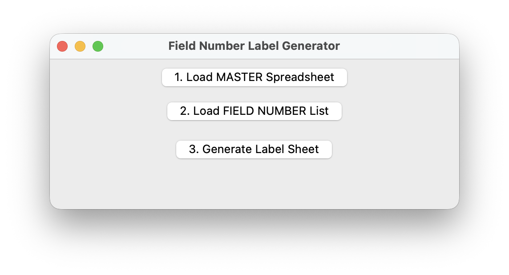

# Temporary Label Generator
This tool allows the user to search a master spreadsheet and generate labels for specific field numbers. It can be altered and expanded to meet the needs of anyone. The generated labels are intended for fieldwork where an extremely large amount of specimens are being generated at once, and hand writing all labels is not feasible. 

## 📦 Folder Contents

```bash
TemporaryLabels/
├─ field_number_label_generator.py      ← Main Python script
├─ fonts/
│  ├─ WorkSans   ← Default font used
│  │ ├─ WorkSans-Regular.otf
│  │ ├─ WorkSans-Italic.otf
├─ README.txt                        ← This file
```

The font WorkSans is an open-source, SIL Open Font License (OFL) typeface bundled here for consistent styling across systems.

## Requirements
### Python

You'll need Python 3.9 or later installed on your computer. Check this by running: 

```bash
python3 --version
```

If you don't have Python, download it from [python.org/downloads]

### Virtual Environment (recommended)
Create and activate a virtual environment from inside the folder to keep dependencies isolated:

```bash
cd TemporaryLabels # CHANGE this to correct folder path
python3 -m venv venv

source venv/bin/activate        # On macOS/Linux
venv\Scripts\activate           # On Windows
```

### Install Dependencies

Once the environment is active, install the required Python packages:

```python
pip install -r requirements.txt
```

## Running the Script

1. Activate your virtual environment (see above).
2. Run the script...

```bash
python3 field_number_label_generator.py
```

You should get a small window that pops up.



